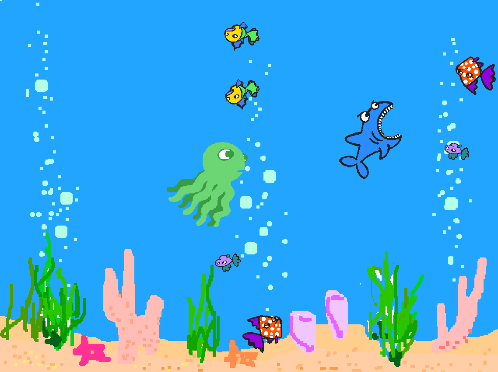

## my-scratch-project-I-made-as-a-kid-2013
# Hunter in the Aquarium

**_I've been involved in software development since I was 7 years old and I found one of my first projects that I made from a very old disc._**
**_This project was made in 2013 for my school assignment with Scratch 1.4._**
**_I hope I can find my projects that I made with html in primary school._**
**_My projects, in which I took my first steps in the sector, really touched me._**

Project Link: https://scratch.mit.edu/projects/663548245/

Game view:

